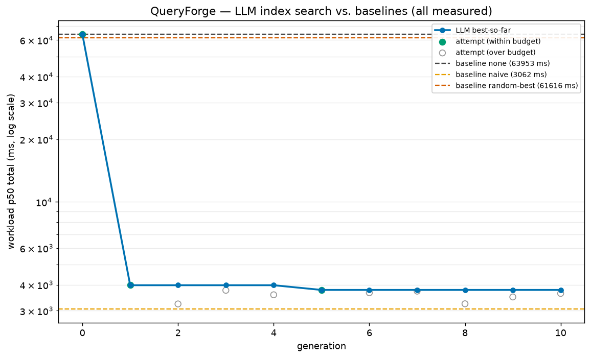

# QueryForge

**LLM-guided search over PostgreSQL index configurations, judged by a real benchmark.**

QueryForge solves the Index Selection Problem — *given a schema, a fixed SQL workload W, and a
storage budget B, find the index set I that minimizes the execution cost of W subject to
size(I) ≤ B* (NP-hard). The classical approach (Microsoft AutoAdmin) does greedy search over the
optimizer's **cost model**. QueryForge replaces the cost model with a **stopwatch** and greedy
enumeration with an **LLM that reads its own measured failures**.

The central rule: **the measurement is ground truth; the LLM never grades itself.** An LLM proposes
a set of `CREATE INDEX` statements; a real PostgreSQL benchmark (`oracle.py`) builds them and times
the workload with `EXPLAIN (ANALYZE, BUFFERS)`. Every number in this project is measured. Nothing
is estimated, simulated, or mocked.

## Result

Workload: the 22 TPC-H queries at scale factor 0.1 (600k-row `lineitem`). Storage budget: **25 MB**.
All four rows below are measured by the **same** oracle.

| configuration | workload p50 | storage | vs. no indexes |
|---|--:|--:|--:|
| none (baseline) | 64,110 ms | 0 MB | 1.0× |
| random search, best ≤ budget (20 trials) | 58,499 ms | 5.2 MB | 1.10× |
| naive — index every candidate column (48 idx) | 3,348 ms | **104 MB** ✗ over budget | — |
| **LLM search (this project)** | **3,308 ms** | **20.1 MB** ✓ | **19.4×** |

<sub>none/naive/random are from `baselines.py`; the LLM row is from `evals/run_search.py`, whose own
no-index baseline measured 64,348 ms (94.9% improvement) — within the oracle's 0.25% run-to-run
variance of the 64,110 ms reference used above. All measured by the same oracle, including
generation 0 in `evals/results.csv`, which is the measured no-index baseline itself.</sub>



**Why this matters.** Random search barely helps (**+10%**): the entire win is concentrated in one
index — `lineitem(l_partkey)` — that rescues the two queries (q17, q20) which otherwise time out at
30 s each, and random sampling almost never picks it. The LLM *reasons* its way to those join keys
from the measured per-query costs and beats random search **17.7×** at an equal benchmark budget.
It even edges out the `naive` "index everything" strawman on raw latency while using **⅕ of the
storage** and staying under budget — naive isn't a real contender since 104 MB blows the 25 MB
budget outright. The search ran 18 of its 20-generation allowance, converging on its best (9 indexes,
20.1 MB) at generation 13 and holding it through the 5-generation stagnation limit.

**Honest caveat (the credibility check).** Every real winning config regresses *something*.
This one makes 2–3 queries slower than the no-index baseline (a scan the planner now does via a
less-ideal index) across the generations that held the best config. `evals/run_search.py` prints a
loud warning if `regressed_queries` is ever 0 for the whole run — because a free lunch means the
oracle is lying. It correctly did **not** fire here.

**This result also stress-tested the failure-feedback loop for real:** generation 16 proposed
`CREATE INDEX ... ON suppliers (s_nationkey)` — the LLM hallucinated a plural table name (the real
table is `supplier`). The oracle caught it, recorded the exact Postgres error
(`relation "suppliers" does not exist`), and the failed statement was correctly excluded from that
generation's built configuration — it never contaminated `best_config` or the archived history the
next prompt reads from.

## How it works

```
baseline ─▶ propose ─▶ validate ─▶ benchmark ─▶ archive ─▶ analyze ─▶ END
              ▲            │  (reject)              │ (loop)
              └────────────┘                        └──▶ back to propose
```

A LangGraph state machine (`graph.py`). Each generation:

1. **propose** — Groq `llama-3.1-8b-instant` proposes an index set as structured JSON
   (Pydantic-validated). Its prompt contains, in order: the schema with row counts; a compact
   **per-query access fingerprint** (the columns each query uses in WHERE/JOIN/GROUP BY/ORDER BY,
   with the query's measured baseline cost — this replaces raw SQL and cuts the prompt from ~7,000
   to ~2,600 tokens); the budget with measured index-size anchors; the top measured configs so far;
   the current best's per-query latencies; and **the previous attempt's exact Postgres error
   strings**. Item six is where the leverage is — failures are never discarded.
2. **validate** — a strict gate: the `CREATE INDEX` allowlist, exact + near-duplicate dedup, and an
   anti-spin fallback.
3. **benchmark** — `oracle.benchmark()` builds the indexes and measures the workload. Ground truth.
4. **archive** — records the measurement; enforces the budget on the **measured** size; feeds the
   real per-index sizes and any DDL errors back into the next prompt.
5. **analyze** — one final `llama-3.3-70b-versatile` call summarizes the run.

The `history` channel uses an `operator.add` reducer so every node *appends* to an append-only log;
this cross-generation memory is what the propose node reads its failures from.

### The oracle is the project (`oracle.py`)

If the oracle lies, everything downstream is fiction, so it was built and gated first
(`evals/variance_check.py` — variance must be ≤ 5%; measured **0.25%**). Its invariants:

- Timing comes from `EXPLAIN (ANALYZE, BUFFERS, FORMAT JSON)` → `"Execution Time"`, **never** Python
  wall-clock (which would include round-trip and serialization noise).
- Session pinned before timing: `max_parallel_workers_per_gather=0`, `jit=off`,
  `statement_timeout=30s`.
- `ANALYZE` after every DDL change — without fresh statistics the planner ignores a new index (the
  #1 reason "my index did nothing").
- One discarded warm-up pass, then 3 timed passes; per-query **median**.
- Each DDL runs in a **savepoint**: a bad statement is recorded with its exact Postgres error and
  stepped over, never allowed to abort the run.
- A query that hits `statement_timeout` is scored at the 30,000 ms penalty and short-circuited.

### Custom workloads (`GET`/`POST /custom`)

The fixed 22-query workload is the default, but the same loop runs against **user-submitted**
queries too. The workload was always a `{qid: sql}` dict; `oracle.benchmark()`, `specs.candidate_columns()`
and `specs.query_fingerprints()` take it as a parameter, defaulting to the cached 22-query set so
`baselines.py`/`run_search.py` are unchanged. `POST /custom` splits the submitted SQL on `;`, runs a
3-generation search, and renders the measured before/after per query. Results are cached in-process by
SHA1 of the sorted queries — a cache hit returns the **real** earlier measurement, explicitly labelled
as cached, never a fresh guess. `GET /custom` also shows a live schema-reference panel (measured row
counts + every column/type) for users who don't know TPC-H.

Running arbitrary user SQL is a new, sharper input surface — see security control 4.

## Security — controls that don't substitute for each other

The LLM generates SQL we execute against a live database, so there are two controls and neither
substitutes for the other:

1. **Allowlist (`specs.validate`)** — every statement must match `^\s*CREATE\s+INDEX`, with no
   statement stacking and no dangerous keywords (`DROP/ALTER/DELETE/UPDATE/INSERT/COPY/GRANT/REVOKE`,
   or `CREATE` of anything but an index). The stacking/keyword checks run with string literals and
   comments stripped first, so a legitimate predicate like `LIKE '%delete%'` can't false-positive
   as a `DELETE` keyword. No bypass flag exists, and it's applied on every path that reaches
   `oracle.benchmark()` — the LLM search, `baselines.py`, and `mcp_server.py` alike.
2. **Identifier validation (`IndexSpec.__post_init__`)** — every field (table, columns, include,
   method) must be a bare SQL identifier before it's interpolated into a DDL string, so no field
   can smuggle extra clause syntax (an undeclared `INCLUDE`, an extra column) into the single
   `CREATE INDEX` statement `to_ddl()` builds. Malicious content in structured-output fields ends
   up inside a DDL string that control 1 re-checks anyway — this is defense in depth, not the
   only thing standing between LLM output and Postgres.
3. **Least privilege (`db/init.sql`)** — the agent connects as `queryforge_agent`
   (`NOSUPERUSER NOCREATEDB NOCREATEROLE`), which owns only the TPC-H tables in a dedicated
   `queryforge` database. Blast radius if controls 1–2 ever failed: the sandbox database, nothing else.
4. **Read-only allowlist for user SQL (`specs.validate_select`)** — the `/custom` endpoint executes
   *arbitrary* user queries. Because the agent **owns** the TPC-H tables (a PG16 ownership deviation,
   below), it *can* drop or alter them, so here the allowlist is not a redundant second control — it
   is the only thing between user input and the tables. Every submitted query must start with `SELECT`
   or `WITH`, contain no statement stacking, and no write/DDL keyword — including `INTO` (blocks
   `SELECT … INTO new_table`) and catching data-modifying CTEs like `WITH x AS (DELETE … RETURNING)`.
   A query that passes the allowlist is then validated a second way — `oracle.explain_check()` runs a
   plain `EXPLAIN` (plans, never executes) and returns Postgres's own exact error if the query is
   invalid — so a bad query is rejected loudly *before* any benchmark or LLM call, never silently.

## Running it

```bash
docker compose up -d                     # PostgreSQL 16
python -m venv venv && venv/Scripts/pip install -r requirements.txt
cp .env.example .env                     # add your GROQ_API_KEY
python load_data.py                      # generate TPC-H SF=0.1 via DuckDB, load, print row counts
python evals/variance_check.py           # the oracle gate — must pass before anything else
python baselines.py                      # none / naive / random×20  → evals/baselines.json
python evals/run_search.py               # the 20-gen search → results.csv + fitness.png
uvicorn app:app --host 0.0.0.0 --port 7860   # /replay UI, /live 3-gen demo, /custom own-query search
python mcp_server.py                     # optional: expose the oracle as MCP tools
```

## Stack

Python 3.11 · PostgreSQL 16 (`psycopg` v3) · LangGraph (`StateGraph` + `MemorySaver`) · Groq
(`llama-3.1-8b-instant` for propose, `llama-3.3-70b-versatile` for the single analyze call —
the free tier binds on tokens/day, so the high-volume path takes the cheap model) · Pydantic ·
FastAPI · pandas + matplotlib · DuckDB (data generation only) · Langfuse (tracing, env-gated).

## Notes and honest deviations from the original spec

These were deliberate calls, made for correctness or defensibility rather than convenience:

- **PostgreSQL 16 requires table *ownership* for `CREATE INDEX` and `ANALYZE`** (the finer-grained
  `MAINTAIN` privilege only arrives in PG17). The spec's "agent has CREATE on schema, not owner"
  cannot build an index on PG16. Fix: the agent *owns* its sandbox tables inside a dedicated
  database; the least-privilege guarantee is preserved at the database boundary.
- **No vector database.** Near-duplicate detection is Jaccard overlap of the canonical DDL sets in
  `archive.py` — a set intersection over a few dozen items, exact and deterministic. Embedding DDL
  strings to do this would be slower and less defensible; top-k by fitness is a sort, not a search.
- **The storage budget is enforced on measured size, not an estimate.** A catalog-derived estimate
  was built and rejected: btree deduplication shrinks real indexes ~2–3× below the flat
  `avg_width × rows` bound unpredictably. Rather than ship a fudge factor, over-budget configs are
  caught by the oracle's real `storage_mb` and the overage is fed back as measured feedback.
- **The prompt feeds per-query access fingerprints, not raw SQL** — same access signal an index
  advisor uses, at ~⅓ the tokens (Groq's free tier caps at 6,000 tokens/minute).
- **Deployment (Docker image seeding + Hugging Face Spaces) is a documented follow-up.** Shared-CPU
  Spaces timing is noisy; the real 20-generation numbers above were produced locally. The Space
  would serve this replay plus a short live demo, not the authoritative benchmark.
- **A structured code review after the first working version found and fixed 10 real bugs** — among
  them: a failed DDL statement could linger in `best_config`/history as if it had been built (fixed
  by filtering to only the DDLs the oracle actually created); `/replay` could silently compute its
  headline "% faster" against the wrong reference line when `baselines.json` was absent; and
  `baselines.py` built DDL without ever running it through the allowlist. All 10 fixes are unit- or
  integration-verified (see `graph.py`'s `archive_node`, `app.py`'s `replay()`, `specs.py`'s
  `validate()`/`IndexSpec`), and the numbers in this README are from a full run *after* the fixes,
  not before.
